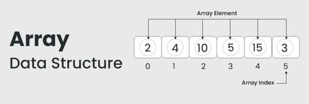
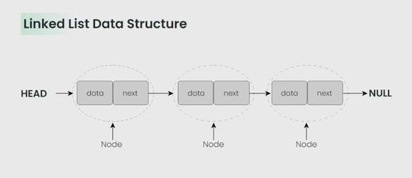
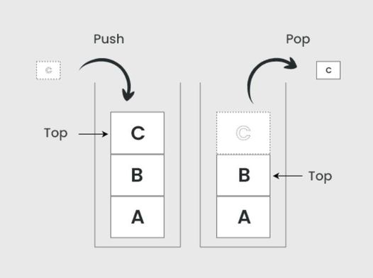
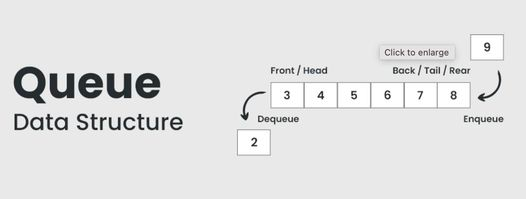
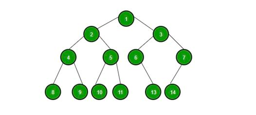
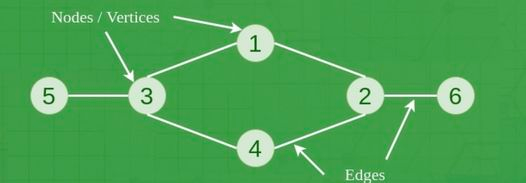
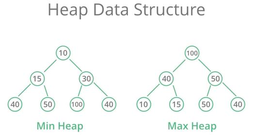
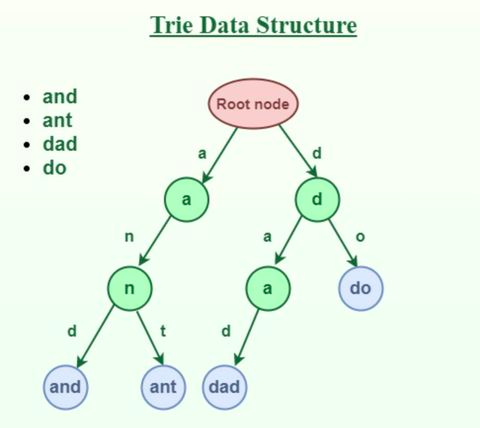
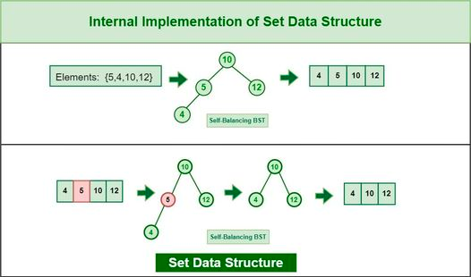

---
<h1 align="center">Series Algorithms Brainstorm</h1>

#### Made by <a href="https://www.facebook.com/anhtaidang.developer">anhtaidang</a>

---
# Table of Contents
- [Top 10 Most Data Structure Engineers need to know](#-top-10-most-data-structure-engineers-need-to-know)

---
## 🧠 Top 10 Most Data Structure Engineers need to know
### 1. Mảng (Arrays):
Mảng là một cấu trúc dữ liệu đơn giản nhất, lưu trữ các phần tử có cùng kiểu dữ liệu trong một vùng nhớ liên tiếp. Mảng cho phép truy xuất nhanh đến phần tử bằng chỉ số. Ví dụ: Mảng được sử dụng để lưu trữ danh sách sinh viên trong một lớp học.
* Đặc điểm: Dữ liệu được sắp xếp theo một dãy có thứ tự.
* Ưu điểm: Truy cập nhanh chóng, đơn giản trong việc thao tác.
* Nhược điểm: Không linh hoạt với việc chèn và xóa dữ liệu.

### 2. Danh Sách Liên Kết (Linked Lists):
Danh sách liên kết là một cấu trúc dữ liệu linh hoạt, mỗi nút chứa dữ liệu và một con trỏ liên kết tới nút tiếp theo. Danh sách liên kết cho phép thêm và xóa phần tử một cách linh hoạt. Ví dụ: Danh sách liên kết được sử dụng để lưu trữ lịch sử trình duyệt.
* Đặc điểm: Dữ liệu liên kết với nhau thông qua các "node".
* Ưu điểm: Linh hoạt với thao tác chèn và xóa.
* Nhược điểm: Truy cập ngẫu nhiên chậm, chiếm nhiều bộ nhớ hơn.

### 3. Ngăn Xếp (Stacks):
Stack là một cấu trúc dữ liệu dạng ngăn xếp (LIFO - Last In, First Out). Nó cho phép thêm và lấy phần tử ra khỏi đỉnh. Stack thường được sử dụng trong việc xử lý các chức năng gọi và quay lui trong ngôn ngữ lập trình. Ví dụ: Stack được sử dụng để xử lý các hàm gọi trong quá trình thực thi chương trình.
* Đặc điểm: Làm việc theo nguyên tắc "Last In, First Out" (LIFO).
* Ưu điểm: Thực hiện đệ quy, quản lý "undo" trong ứng dụng.
* Nhược điểm: Giới hạn kích thước.

### 4. Hàng Đợi (Queues):
Queue là một cấu trúc dữ liệu dạng hàng đợi (FIFO - First In, First Out). Nó cho phép thêm và lấy phần tử ra khỏi đầu hàng đợi. Queue thường được sử dụng trong các thuật toán liên quan đến lập lịch và xử lý dữ liệu theo thứ tự. Ví dụ: Queue được sử dụng để quản lý các yêu cầu đến một máy chủ.
* Đặc điểm: Làm việc theo nguyên tắc "First In, First Out" (FIFO).
* Ưu điểm: Quản lý dữ liệu theo thứ tự, phục vụ các thuật toán như BFS.
* Nhược điểm: Truy cập ngẫu nhiên chậm.

### 5. Cây Nhị Phân (Binary Trees):
Cây là một cấu trúc dữ liệu phân cấp có gốc và các nút con. Mỗi nút trong cây có thể có nhiều nút con. Cây được sử dụng rộng rãi trong các thuật toán tìm kiếm, sắp xếp và lưu trữ dữ liệu phân cấp. Ví dụ: Cây được sử dụng trong cấu trúc thư mục của hệ điều hành.
* Đặc điểm: Mỗi node có tối đa hai con.
* Ưu điểm: Thực hiện tìm kiếm và sắp xếp hiệu quả.
* Nhược điểm: Có thể trở thành "unbalanced", gây giảm hiệu suất.

### 6. Đồ Thị (Graphs):
Đồ thị là một cấu trúc dữ liệu gồm các đỉnh và các cạnh kết nối giữa các đỉnh. Đồ thị có thể là hướng và vô hướng. Nó được sử dụng để mô phỏng các mối quan hệ phức tạp giữa các đối tượng. Ví dụ: Đồ thị được sử dụng để mô phỏng các mạng xã hội.
* Đặc điểm: Bao gồm các "đỉnh" và "cạnh".
* Ưu điểm: Mô hình hóa mối quan hệ phức tạp.
* Nhược điểm: Cần nhiều bộ nhớ hơn cho lưu trữ.

### 7. Bảng Băm (Hash Tables):
Bảng băm là một cấu trúc dữ liệu sử dụng cơ chế băm để lưu trữ và truy xuất dữ liệu nhanh chóng. Nó ánh xạ các khóa vào các giá trị tương ứng trong bảng. Bảng băm thường được sử dụng trong việc tìm kiếm, thêm và xóa dữ liệu với độ phức tạp thời gian gần như O(1). Ví dụ: Bảng băm được sử dụng để lưu trữ từ điển trong một ứng dụng từ điển.
* Đặc điểm: Dữ liệu được lưu trữ dưới dạng cặp "key-value".
* Ưu điểm: Truy cập nhanh, hiệu quả cho các phép tìm kiếm.
* Nhược điểm: Xử lý xung đột khó khăn.

### 8. Heap:
Heap là một cấu trúc dữ liệu dạng cây nhị phân đầy đủ hoặc cây nhị phân đầy đủ gần đúng. Nút cha luôn có giá trị lớn (hoặc nhỏ) hơn các nút con. Heap thường được sử dụng để tìm kiếm phần tử lớn nhất (hoặc nhỏ nhất) trong một tập hợp. Ví dụ: Heap được sử dụng trong thuật toán sắp xếp heapsort.
* Đặc điểm: Dùng cho việc quản lý ưu tiên.
* Ưu điểm: Tìm kiếm phần tử lớn nhất (hoặc nhỏ nhất) hiệu quả.
* Nhược điểm: Thao tác chèn và xóa có thể chậm.

### 9. Đồ thị băm (Trie):
   Đồ thị băm là một cấu trúc dữ liệu dùng để lưu trữ và tìm kiếm các từ hoặc chuỗi. Nó sắp xếp các ký tự thành các nhánh và sử dụng ký tự ở mỗi nút để xác định từ hoặc chuỗi. Đồ thị băm thường được sử dụng trong các ứng dụng văn bản như từ điển, kiểm tra chính tả và gợi ý từ.
* Đặc điểm: Dùng cho việc lưu trữ và tìm kiếm từ vựng.
* Ưu điểm: Tìm kiếm từ hiệu quả, tiết kiệm bộ nhớ.
* Nhược điểm: Cần nhiều bộ nhớ.

### 10. Đa tập hợp (Set):�Đa tập hợp là một cấu trúc dữ liệu không chứa các phần tử trùng lặp. Nó cung cấp các phép toán như thêm, xóa và kiểm tra sự tồn tại của phần tử. Đa tập hợp được sử dụng để loại bỏ các phần tử trùng lặp và thực hiện các phép toán tập hợp như giao, hợp và hiệu.
* Đặc điểm: Phục vụ những phép toán tập hợp
* Ưu điểm: Loại bỏ những phần tử trùng lặp
* Nhược điểm: Có thể sẽ tiêu tốn nhiều bộ nhớ

[[↑] Back to top](#table-of-contents)
