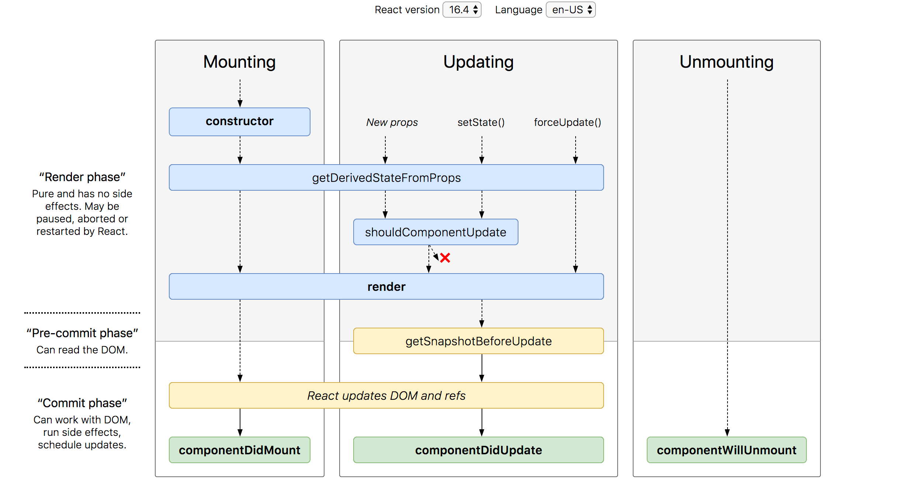
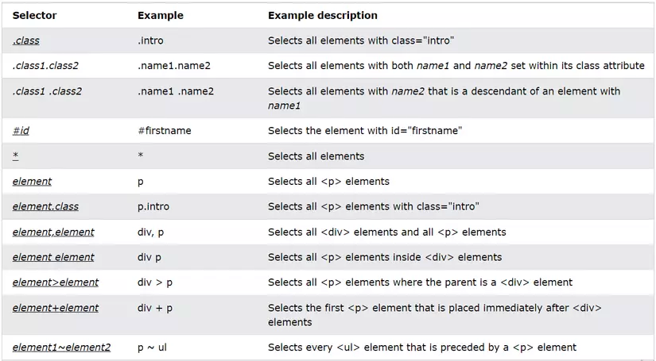

---
<h1 align="center">Series Frontend ReactJS, HTML  - State Management Brainstorm</h1>

#### Made by <a href="https://www.facebook.com/anhtaidang.developer">anhtaidang</a>


---
# Table of Contents
- [Explain React Component Lifecycle](#-explain-react-component-lifecycle)
- [Explain Virtual DOM](#-explain-virtual-dom)
- [Explain Hooks in ReactJS](#-explain-hooks-in-reactjs)
- [Explain `data-` attribute in DOM HTML](#-explain-data--attribute-in-dom-html)
- [Explain how interactive with DOM](#-explain-data--attribute-in-dom-html)
- [Explain HTML sematic](#-explain-html-sematic)
- [Explain SEO, How to SEO for Web](#-explain-seo-how-to-seo-for-web)
- [Explain someway to Optimize Refactor Performance in React](#-explain-someway-to-optimize-refactor-performance-in-react)
- [Explain useEffect vs useLayoutEffect](#-explain-useeffect-vs-uselayouteffect)
- [Explain (px, rem, em), Box-sizing: border-box, Model box, Responsive, css Selector, Pseudo-class](#-explain-px-rem-em-box-sizing-border-box-model-box-responsive-css-selector-pseudo-class)
- [Explain BEM? Naming standard CSS follow BEM](#-explain-bem-naming-standard-css-follow-bem)

---
## 🧠 Explain React Component Lifecycle
>- Lifecycle của một React component là chu kỳ của component từ khi nó được tạo ra, hiển thị lên giao diện, cho đến khi nó bị hủy bỏ hoặc unmount.
>- React đã giới thiệu một số phương thức vòng đời (lifecycle methods) để cho phép bạn can thiệp và xử lý logic tại các điểm khác nhau trong chu kỳ của component.



**1.Mounting (Khởi tạo):**
- `constructor()`: Phương thức khởi tạo được gọi khi component được tạo ra. Bạn có thể sử dụng nó để thiết lập state ban đầu và bind các phương thức.
static getDerivedStateFromProps(props, state): Phương thức này được gọi trước khi render và mỗi khi props thay đổi. Nó cho phép bạn cập nhật state dựa trên props mới.
- `render()`: Phương thức này trả về JSX để hiển thị giao diện của component.

**2.Updating (Cập nhật):**
- `static getDerivedStateFromProps(props, state)`: Được gọi khi component đã được khởi tạo và mỗi khi props thay đổi. Tương tự như trong Mounting.
shouldComponentUpdate(nextProps, nextState): Cho phép bạn quyết định xem component có cần được render lại khi props hoặc state thay đổi. Trả về true để render và false để ngăn cản render.
- `render()`: Được gọi để render lại giao diện component.
- `getSnapshotBeforeUpdate(prevProps, prevState)`: Được gọi trước khi component thực sự được cập nhật. Thường được sử dụng để lấy thông tin từ DOM (ví dụ: vị trí cuộn) trước khi nó bị thay đổi.
- `componentDidUpdate(prevProps, prevState, snapshot)`: Được gọi sau khi component đã cập nhật. Thường được sử dụng để thực hiện các tác vụ sau cập nhật, chẳng hạn như gọi API hoặc cập nhật DOM.

**3.Unmounting (Hủy bỏ):**
- `componentWillUnmount()`: Được gọi trước khi component bị hủy bỏ hoặc unmount khỏi DOM. Thường được sử dụng để hủy các kết nối, ngắt các tài nguyên, hoặc xóa các thư viện khỏi bộ nhớ.

> Ngoài các phương thức trên, React 16.3 đã giới thiệu một số phương thức vòng đời mới, bao gồm getDerivedStateFromProps và getSnapshotBeforeUpdate, và đã xóa bỏ một số phương thức cũ như componentWillMount, componentWillReceiveProps, và componentWillUpdate.
> 
> Lưu ý rằng React 16.3 trở đi, các phương thức vòng đời cũ đã bị deprecated và không nên được sử dụng. Thay vào đó, bạn nên sử dụng các phương thức vòng đời mới và hooks (nếu bạn đang sử dụng React 16.8 trở đi) để quản lý lifecycle của component.

[[↑] Back to top](#table-of-contents)

## 🧠 Explain Virtual DOM.

Virtual DOM (Document Object Model)
Virtual DOM (DOM ảo) là một mô hình dữ liệu đại diện cho DOM thực.<br /> 
Virtual DOM là một biểu diễn ảo của cây DOM thực tế của trang web. Nó được sử dụng để tối ưu hóa hiệu suất và cải thiện tính năng khi làm việc với DOM thật trong ứng dụng web.

Dưới đây là cách Virtual DOM hoạt động:

**1. Tạo một biểu diễn ảo của DOM**: Khi một thay đổi xảy ra trong ứng dụng web (ví dụ: sự kiện người dùng hoặc dữ liệu thay đổi), React và các thư viện tương tự tạo ra một bản sao ảo của cây DOM hiện tại. Cây này được gọi là Virtual DOM.<br/>
**2. So sánh với DOM thật**: Virtual DOM sau đó được so sánh với DOM thật để tìm ra sự khác biệt giữa chúng. Nói cách khác, React xác định xem nội dung thực tế của trang web đã thay đổi như thế nào so với biểu diễn ảo.<br/>
**3. Tính toán các thay đổi cần thiết**: Dựa trên sự khác biệt, React tính toán các thay đổi cần thiết để đưa DOM thực tế về trạng thái mới, chứa tất cả các thay đổi từ Virtual DOM.<br/>
**4. Áp dụng thay đổi vào DOM thật**: Cuối cùng, React áp dụng các thay đổi đã tính toán vào DOM thật, cập nhật giao diện người dùng theo cách hiệu quả nhất.<br/>

Lợi ích của Virtual DOM bao gồm:

- **Tối ưu hóa hiệu suất**: Virtual DOM giúp giảm thiểu số lượng thao tác trực tiếp trên DOM thật, giúp cải thiện hiệu suất của ứng dụng web.
- **Tự động xác định thay đổi**: Virtual DOM tự động xác định các phần của trang cần được cập nhật, giúp tránh việc cập nhật toàn bộ trang.
- **Giảm khả năng xảy ra lỗi**: Bằng cách sử dụng Virtual DOM, bạn có thể tránh được nhiều lỗi phổ biến liên quan đến việc thao tác trực tiếp trên DOM.

[[↑] Back to top](#table-of-contents)

## 🧠 Explain Hooks in ReactJS
Hooks là một tính năng được giới thiệu từ phiên bản React 16.8 và giúp chúng ta sử dụng các tính năng của React như state và lifecycle trong các thành phần hàm (function components).
Dưới đây là một số hook quan trọng và phổ biến trong React:

- `useState`: Cho phép bạn quản lý state trong một thành phần hàm. Bằng cách sử dụng useState, bạn có thể tạo và cập nhật biến trạng thái trong một thành phần.
- `useEffect`: Cho phép bạn thực hiện các side effect (như gọi API, thay đổi DOM, đăng ký sự kiện) sau khi thành phần đã được render. useEffect giúp bạn quản lý các hoạt động không đồng bộ.
- `useContext`: Cho phép bạn truy cập các giá trị được chia sẻ global thông qua Context API của React. Điều này giúp bạn truyền dữ liệu giữa các thành phần con mà không cần sử dụng props.
- `useRef`: Được sử dụng để tạo một tham chiếu đến một phần tử DOM hoặc một giá trị không thay đổi theo thời gian. Thường được sử dụng trong việc thao tác với DOM trực tiếp.
- `useReducer`: Cho phép bạn quản lý state bằng cách sử dụng một hàm reducer, giúp bạn xử lý các trạng thái phức tạp hơn.
- `useCallback` và `useMemo`: Được sử dụng để tối ưu hóa hiệu suất bằng cách tránh việc tính toán lại giá trị hoặc render lại thành phần không cần thiết.
- `useLayoutEffect`: Tương tự như `useEffect`, nhưng chạy đồng bộ và được sử dụng khi cần truy cập layout của DOM trước khi giao diện được cập nhật.
- `useEffectCleanup`: Được sử dụng để dọn dẹp các side effect khi thành phần bị unmount hoặc khi dependency thay đổi.

Hooks giúp viết mã React trở nên ngắn gọn, dễ đọc, và dễ bảo trì hơn. Chúng giúp bạn tái sử dụng logic, tránh việc sử dụng class components (nếu bạn muốn), và giúp tối ưu hóa hiệu suất của ứng dụng React.

[[↑] Back to top](#table-of-contents)

## 🧠 Explain `data-` attribute in DOM HTML
Thuộc tính data trong HTML là một thuộc tính cho phép bạn lưu trữ thêm thông tin hoặc dữ liệu trong DOM.
Các thuộc tính data có thể được sử dụng bằng cách sử dụng tiền tố "data-" theo sau là tên tùy chỉnh.

Dưới đây là một ví dụ về cách sử dụng thuộc tính data:
```html
<!DOCTYPE html>
<html>
<head>
    <title>Thuộc tính data trong HTML</title>
</head>
<body>
    <div id="myElement" data-user-id="123" data-username="john_doe" data-email="john@example.com"></div>
</body>
</html>
```

Trong ví dụ này, chúng ta có một phần tử <div> với ba thuộc tính `data-` khác nhau: `data-user-id`, `data-username`, và `data-email`. Các thuộc tính này lưu trữ thông tin về người dùng liên quan đến phần tử này.

Để truy cập dữ liệu trong các thuộc tính `data` này bằng JavaScript, bạn có thể sử dụng thuộc tính `dataset` của phần tử. Ví dụ:
```javascript
const myElement = document.getElementById("myElement");

const userId = myElement.dataset.userId;
const username = myElement.dataset.username;
const email = myElement.dataset.email;

console.log(userId); // "123"
console.log(username); // "john_doe"
console.log(email); // "john@example.com"
```
[[↑] Back to top](#table-of-contents)

## 🧠 Explain how interactive with DOM
Các thao tác cơ bản với DOM (Document Object Model) là quan trọng khi làm việc với JavaScript để tương tác và thay đổi nội dung của trang web.

1.Truy xuất phần tử (Selecting Elements):
- `getElementById()`: Lấy phần tử bằng ID.
- `getElementsByClassName()`: Lấy danh sách các phần tử bằng class.
- `getElementsByTagName()`: Lấy danh sách các phần tử bằng tên thẻ (tag name).
- `querySelector()`: Lấy phần tử đầu tiên dựa trên một selector CSS.
- `querySelectorAll()`: Lấy tất cả các phần tử dựa trên một selector CSS.

2.Truy xuất và thay đổi nội dung (Accessing and Modifying Content):
- `innerHTML`: Lấy hoặc thiết lập nội dung HTML của một phần tử.
- `textContent`: Lấy hoặc thiết lập nội dung văn bản của một phần tử.
- `value`: Lấy hoặc thiết lập giá trị của một phần tử nhập liệu (input).
- `getAttribute()`: Lấy giá trị của thuộc tính cụ thể của một phần tử.
- `setAttribute()`: Thiết lập giá trị của thuộc tính cụ thể của một phần tử.

3. Thêm và xoá phần tử (Adding and Removing Elements):
- `createElement()`: Tạo một phần tử HTML mới.
- `appendChild()`: Thêm một phần tử con vào phần tử cha.
- `removeChild()`: Xoá một phần tử con khỏi phần tử cha.
- `insertBefore()`: Chèn một phần tử trước một phần tử khác.

4.Thêm và xoá lớp CSS (Adding and Removing CSS Classes):
- `classList.add()`: Thêm một lớp CSS mới cho phần tử.
- `classList.remove()`: Xoá một lớp CSS khỏi phần tử.
- `classList.toggle()`: Đảo ngược trạng thái của một lớp CSS (nếu có thì xoá, nếu không thì thêm vào).

5.Xử lý sự kiện (Handling Events):
- `addEventListener()`: Đăng ký một hàm xử lý sự kiện cho một phần tử.
- `removeEventListener()`: Huỷ đăng ký một hàm xử lý sự kiện.


[[↑] Back to top](#table-of-contents)

## 🧠 Explain HTML sematic
- HTML semactic có nghĩa là sử dụng thẻ thích hợp nhất cho ý nghĩa của nó. Nó có nghĩa là sử dụng các phần tử có ý nghĩa như `form`, `article` và `table` thay vì chỉ sử dụng `div` và `span`.
- HTML Semantic giúp trang web trở nên dễ đọc và dễ hiểu cho cả máy tính và con người. Nó cũng có lợi ích trong việc tối ưu hóa SEO (Search Engine Optimization), giúp các công cụ tìm kiếm hiểu rõ hơn về nội dung của trang web. Một số ví dụ về các thẻ và phần tử HTML semantic bao gồm:
- Sử dụng các thẻ và phần tử semantic giúp trang web trở nên có cấu trúc, dễ bảo trì và cải thiện trải nghiệm người dùng.


- `header`: Được sử dụng để đại diện cho phần tiêu đề của trang web hoặc một phần của trang.
- `nav`: Được sử dụng để đại diện cho một phần liên kết đến các trang hoặc khu vực điều hướng của trang web.
- `main`: Được sử dụng để bao bọc nội dung chính của trang.
- `article`: Được sử dụng để biểu thị một bài viết, một tin tức hoặc một phần nội dung độc lập có ý nghĩa.
- `section`: Được sử dụng để nhóm các phần của trang có cùng chủ đề hoặc mục tiêu.
- `aside`: Được sử dụng để đại diện cho nội dung bên lề, thường là thông tin bổ sung hoặc liên quan đến nội dung chính.
- `footer`: Được sử dụng để đại diện cho phần cuối trang web hoặc một phần cụ thể của trang.
- `figure` và `figcaption`: Được sử dụng để chứa hình ảnh hoặc biểu đồ cùng với một phần mô tả (caption).

[[↑] Back to top](#table-of-contents)

## 🧠 Explain SEO, How to SEO for Web

SEO -Search Engine Optimization nghĩa là tối ưu hóa vị trí tìm kiếm trên các công cụ tìm kiếm như: Google..

Một vài cách SEO một trang web đơn giản:

1.Sử dụng đầy đủ thẻ `meta`<br/>
2.Sử dụng thẻ `sematic`<br/>
> Sử dụng thẻ HTML semantic để giúp công cụ tìm kiếm hiểu rõ cấu trúc trang web của bạn.
> 
3.Sử dụng nhiều thẻ `h1` cho tiêu đề<br/>
4.Thẻ `Image` buộc phải có thuộc tính `alt`<br/>
5.Nghiên cứu từ khóa (Keyword Research):<br/>
6.Tối ưu hóa hình ảnh và đa phương tiện (Image and Media Optimization)<br/>
> Đặt tên tập tin hình ảnh một cách mô tả và sử dụng thuộc tính "alt" để mô tả hình ảnh.
> Nén hình ảnh để giảm dung lượng tải về và tăng tốc độ tải trang.
> 
7.Tối ưu hóa tốc độ trang (Page Speed Optimization)<br/>
8.Sitemap và robots.txt:
> Tạo sitemap.xml để giúp công cụ tìm kiếm hiểu cấu trúc trang web của bạn.
> Sử dụng tệp robots.txt để kiểm soát việc các công cụ tìm kiếm có quyền truy cập vào trang web của bạn hay không.
>

[[↑] Back to top](#table-of-contents)

## 🧠 Explain someway to Optimize Refactor Performance in React
Dưới đây là một số cách tối ưu khi sử dụng ReactJS để làm cho ứng dụng React của bạn chạy nhanh hơn và tiêu tốn ít tài nguyên hơn:

**1. Sử dụng React.memo và PureComponent:**
- React cung cấp React.memo và PureComponent để tối ưu hóa việc render lại các thành phần. Điều này giúp tránh việc render lại không cần thiết khi props hoặc state không thay đổi.

**2. Sử dụng Keys duy nhất:**
- Đảm bảo mỗi phần tử trong danh sách có một key duy nhất để giúp React xác định các sự thay đổi hiệu quả hơn khi danh sách được cập nhật.

**3.Tách thành phần nhỏ hơn:**
- Chia thành phần lớn thành các thành phần nhỏ hơn và tái sử dụng chúng. Điều này giúp làm giảm độ phức tạp của mã và giúp quản lý state dễ dàng hơn.

**4.Memoization:**
- Sử dụng memoization để lưu trữ kết quả của các hàm tính toán phức tạp để tránh tính toán lại khi các đầu vào không thay đổi.

**5.Sử dụng Thư viện Thứ ba cần thiết lựa chọn:**
- Sử dụng các thư viện bên ngoài như reselect để tối ưu hóa chọn lọc dữ liệu từ store Redux hoặc bất kỳ thư viện nào phù hợp với nhu cầu của bạn.

**6.Code Splitting:**
- Sử dụng code splitting để tải các phần của ứng dụng khi cần thiết thay vì tải tất cả mã nguồn cùng lúc. Điều này giúp giảm thời gian tải và tải nhẹ ứng dụng.

**7.Lazy Loading:**
- Sử dụng `React.lazy` và `Suspense` để tải lười (lazy load) các thành phần khi chúng cần được hiển thị, giúp giảm thời gian tải trang ban đầu.

**8.Memoization và Caching dữ liệu:**
- Sử dụng memoization và caching để lưu trữ và quản lý dữ liệu từ API hoặc dữ liệu có thể được chia sẻ giữa các thành phần.

**8.Profiler:**
- Sử dụng React Profiler để theo dõi hiệu suất ứng dụng và tìm ra các vấn đề có thể tối ưu hóa.

**9.Server-Side Rendering (SSR):**
- Sử dụng Server-Side Rendering để cải thiện tốc độ tải trang ban đầu và SEO.

**10.Thực hành Làm sạch Component (Component Cleanup):**
- Đảm bảo bạn dọn dẹp các tài nguyên không cần thiết như các sự kiện đăng ký, kết nối WebSocket khi không cần sử dụng nữa.

**11.Kiểm tra sự thay đổi với `shouldComponentUpdate` hoặc `React.memo`:**
- Sử dụng `shouldComponentUpdate` hoặc `React.memo` để kiểm tra xem một thành phần có cần render lại hay không dựa trên các điều kiện nhất định.

Tối ưu hóa ứng dụng React là một quá trình liên tục và cần kiên nhẫn. Hãy sử dụng công cụ phân tích hiệu suất và kiểm tra thường xuyên để xác định và giải quyết các vấn đề về hiệu suất.


[[↑] Back to top](#table-of-contents)

## 🧠 Explain useEffect vs useLayoutEffect
- Trước khi giải thích về `useEffect` và `useLayoutEffect`, hãy hiểu rõ rằng cả hai đều là hooks trong React.<br/>
- Hooks là một tính năng được giới thiệu từ phiên bản React 16.8 và giúp chúng ta sử dụng các tính năng của React như state và lifecycle trong các thành phần hàm (function components).

`useEffect` và `useLayoutEffect` đều được sử dụng để thực hiện các side effect trong React. Side effect là những hành động không thuộc phạm vi của việc render giao diện người dùng, chẳng hạn như gọi API, làm thay đổi DOM, đăng ký sự kiện, v.v.

Tuy nhiên, có một sự khác biệt quan trọng giữa hai hook này liên quan đến thời điểm thực hiện side effect.

>1.`useEffect` chạy bất đồng bộ và sau khi màn hình UI được cập nhật:<br/>
>- Bạn gây ra một render nào đó ( ví dụ như thay đổi state, re-render từ component cha )
>- Render component
>- Màn hình UI được cập nhật
>- useEffect chạy

>2.`useLayoutEffect` chạy đồng bộ sau khi render nhưng trước khi màn hình UI được cập nhật:<br/>
> `useLayoutEffect` sẽ được chạy đồng bộ ngay lập tức sau khi React đã thực hiện tất cả các DOM mutations.<br/> 
> Điều này có thể hữu ích nếu bạn muốn đo lường các DOM (Như việc bạn muốn lấy vị trí cuộn, vị trí của các phần tử) và sau đó tạo DOM mutations hoặc trigger hiển thị một cách đồng bộ bằng cách cập nhật trạng thái.<br/>
>- Bạn gây ra một render nào đó ( ví dụ như thay đổi state, re-render từ component cha )
>- Render component
>- useLayoutEffect chạy, và React sẽ đợi đến khi nó chạy hoàn thành
>- Màn hình UI được cập nhật

**Tóm tắt lại**

- `useLayoutEffect`: Chỉ sử dụng trong các trường hợp bạn cần thay đổi DOM hoặc thực hiện các phép tính đo lường, các trường hợp xảy ra lỗi từ useEffect. Hãy nghĩ đến useLayoutEffect như một giải pháp.
- `useEffect`: Nếu bạn không cần tương tác với DOM trong hầu hết trường hợp nên sử dụng useEffect.

[[↑] Back to top](#table-of-contents)

## 🧠 Explain (px, rem, em), Box-sizing: border-box, Model box, Responsive, css Selector, Pseudo-class

### Box-sizing: border-box là gì?
Khi chúng ta set một border,padding cho phần tử thì kích thước ban đầu sẽ tăng lên vì vậy cần sử dụng Box-`sizing: border-box` để ngăn chặn điều đó, nó sẽ tính toán lại phần content sao cho content + với các phần tăng thêm sẽ bằng với kích thước mà chúng ta đặt ra ban đầu.

### Model box là gì?

Bao gồm: Content ( phần nội dung chính ), Border ( phần viền ), Padding ( phần đệm thêm ), Margin ( phần dịch chuyển ).

Bạn có thể Inspect một element nào đó, sau đó vào tab `Computed` để xem model box của element đó.

### Responsive
Khi responsive chúng ta dùng thẻ @media.

Các break-point cơ bản cho các thiết bị như:
>- Mobile: 0 > 768px
>- Tablet: 769px > 1024px
>- Desktop: 1024px trở lên

Ví dụ: Đối với thiết bị từ 0 > 600px sẽ có background màu đỏ
```css
@media only screen and (max-width: 600px) {
  div {
    background-color: red;
  }
}
```

### CSS Selector
Những CSS Selector cơ bản bạn có thể tham khảo


### Pseudo-class
- Một Pseudo class trong CSS được dùng để xác định trạng thái đặc biệt của một phần tử. Nó có thể được kết hợp với class để thêm hiệu ứng cho các phần tử.
- Một số Pseudo class cơ bản như: hover, visited, focus, focus-within, disable, checked....

```css
/* 
   Khi thẻ a được hover sẽ hiển thị màu xanh
*/
a:hover {
  color: green;
}
```

[[↑] Back to top](#table-of-contents)

## 🧠 Explain BEM? Naming standard CSS follow BEM

### BEM là gì?
BEM là viết tắt của cụm `Block – Element – Modifier`, là tiêu chuẩn quy ước đặt tên cho các tên lớp CSS. BEM giúp việc lập trình Front-end trở nên dễ hiểu, dễ đọc hơn, dễ làm việc và dễ mở rộng cũng như bảo trì khi làm việc với CSS.
Việc đặt tên theo tiêu chuẩn giúp các lập trình viên frontend hiểu được đoạn code đó có nghĩa là gì, nó thực hiện nhiệm vụ gì? Từ đó những lập tình viên khác khi đọc code của họ cũng hiểu được bạn đang làm gì, từ đó dễ dàng phân tích, thay đổi và quản lý.

### Tại sao nên dùng BEM?
Đối với những dự án nhỏ thì BEM có thể chưa cần đến, tuy nhiên các dự án lớn và làm việc nhóm thì BEM rất quan trọng.
- <b>Giúp cho team làm việc với nhau dễ dàng hơn</b>: Khi làm Teamwork với nhau, mỗi người đều sẽ có một cách đặt tên class riêng và sẽ bị conflict với nhau. Việc sử dụng BEM sẽ bị loại bỏ vấn đề này vì có cấu trúc rõ ràng và dễ dàng tuân thủ khi sử dụng.
- <b>Modules</b>: Các class của mỗi block sẽ không bị ảnh hưởng gì bởi các yếu tố khác, vì thế bạn sẽ không cần quá lo CSS của class này sẽ gây ảnh hưởng đến class khác.
- <b>Tái sử dụng lại</b>: Bạn có thể soạn các block riêng biệt và sử dụng lại chúng một cách thuận tiện và giảm số lượng code CSS.
- <b>Cấu trúc</b>: BEM cung cấp cho CSS một cấu hình vững chắc, đơn giản và rất dễ hiểu.

### Quy ước đặt tên của BEM

```css
.block {} /* Block */
.block__element {} /* Element */
.block--modifier {} /* Modifier */
```
<b>1. Block</b>: Là một thành phần của trang web hay ứng dụng đó, các thành phần của DOM cũng có thể là các block. Block ở đây thường là các thành phần header, body, content, footer. Ví dụ section td bên dưới tập hợp các block sau:
- `.td__container` làm nhiệm vụ cân max width và padding left right.<br/>
  `.td__inner` làm nhiệm vụ cân padding top bottom và điểm bám cho các element absolute. VD: chỉnh một button…<br/>
  `.td__header` chứa Sub-title.<br/>
  `.td__content` chứa Headline và Description.<br/>
  `.td__footer` chứa button CTA.<br/>

Các prefix của các class đều là td giúp chúng ta có thể nhận diện section khi muốn update mục tương ứng trong css.

<b>2. Elements</b>: Là một thành phần của một block và sẽ không tồn tại độc lập mà không có block vì được đặt bên trong nó, và chúng phụ thuộc vào parent block của nó. Trong BEM, các phần tử được biểu thị bằng dấu gạch dưới kép `__`.
- `.td__headline` là Text cỡ lớn. Style thường là H1 hoặc H2.<br/>
  `.td__intro`, `.td__description` làm mô tả content.<br/>
  `.td__image` chứa ảnh.<br/>
  `.td__button` với style riêng cho button trong section này.<br/>

<b>3. Modifers</b>: Được dùng để thao tác thay đổi cách hiển thị trên block hoặc phần tử. Ví dụ mình muốn tạo thêm một block `.block__elem` khác nữa và muốn làm nổi bật nó thì sẽ thêm một class `.block__elem--hightlight` để tạo sự khác biệt đó.

### Lợi ích khi sử dụng BEM
- Style của block không phụ thuộc vào các phần tử khác trên một trang, vì vậy bạn sẽ không bao giờ gặp vấn đề từ việc xếp tầng. Bạn cũng có thể chuyển các block từ dự án đã hoàn thành của mình sang các dự án mới.
- Có thể tạo ra các block độc lập, xây dựng thành một thư viện các block để tái sử dụng chúng. Điều này sẽ giúp cho CSS của bạn trở nên hiệu quả hơn và làm giảm lượng code CSS mà bạn sẽ phải bảo trì.
- BEM cung cấp cho code CSS của bạn một cấu trúc vững chắc mà vẫn đơn giản và dễ hiểu.

### Quy tắc, cách sử dụng BEM trong Block, Element, Modifier
<i>ĐỐI VỚI BLOCK</i>
<h4><b>Quy tắc đặt tên</b></h3>
- Tên của block có thể bao gồm các chữ cái Latinh, chữ số và cả dấu gạch ngang
- Tạo CSS class: thêm một tiền tố ở phía trước. VD như: .block
- Bất kỳ node DOM nào cũng có thể là một block nếu như nó có một class name

VD như: `<div class=”block”>…</div>`

<h4><b>Cách sử dụng trong CSS</b></h4>
- Chỉ sử dụng bộ chọn của class
- Không dùng tên thẻ hoặc id
- Không phụ thuộc vào các block/element trên 1 trang

VD như: .block { color: #042; }

<i>ĐỐI VỚI ELEMENT</i>
<h4><b>Quy tắc đặt tên</b></h4>
- Tên Element có thể bao gồm các chữ số, chữ cái Latinh, dấu gạch ngang, gạch dưới.
- Tạo class CSS: tên block cộng với 2 dấu gạch dưới và tên Element.

VD như: .block__elem

- Bất kỳ một node DOM nào trong một block cũng đều có thể là một element
- Trong một block nhất định, tất cả các element cũng đều bằng nhau về mặt ngữ nghĩa

```html
<div class=”block”>
    …
    <span class=”block__elem”> </span>
</div>
```

<h4><b>Cách sử dụng trong CSS</b></h4>

- Chỉ sử dụng được bộ chọn class
- Không thể sử dụng tên thẻ hoặc id
- Không phụ thuộc vào các block/ element trên các trang mạng khác


```css
Nên: 
    .block__elem { color: #042; }
Không nên: 
    .block .block__elem { color: #042; }
    div.block__elem { color: #042; }
```

<i>ĐỐI VỚI MODIFIER</i>
<h4><b>Quy tắc đặt tên</b></h4>
- Tên của Modifier có thể gồm các chữ cái Latinh, dấu gạch ngang, chữ số và dấu gạch dưới
- Tạo class CSS: tên của block hoặc element cộng hai dấu gạch ngang, cộng với tên của Modifier
- Dấu cách trong các Modifier dài sẽ được thay thế bằng dấu gạch ngang.


```css
.block–mod { }
.block__elem–mod { }
.block–color-black { }
.block–color-red { }
```

- Modifier là tên class mà bạn thêm vào node DOM block/ element
- Tăng thêm các Modifier class vào các nhóm block/ element mà chúng ta cần sửa đổi và giữ lại class ban đầu của block/element đó.

VD như: <br/>
```html
Nên: 
    <div class=”block block–mod”>…</div>
    <div class=”block block–size-big block–shadow-yes”>…</div>
Không nên: 
    <div class=”block–mod”>…</div>
```

<h4><b>Cách sử dụng trong CSS</b></h4>
- Sử dụng Modifier class với bộ CSS


```css
.block–hidden { }
```

- Thay đổi các element dựa trên các block có chứa modifier

```css
.block–mod .block__elem { }
```

- Element có Modifier

```css
.block__elem–mod { }
```

### Một số lưu ý khi sử dụng BEM

BEM không có khả năng phản ánh cấu trúc lồng nhau của các block và các element. Giả sử: Một block có chứa element 1, element 1 chứa element 2, element 2 chứa element 3. Khi đó, tên của class của block và element nên đặt như sau:

HTML
```html
<div class=”block”>
    <div class=”block__elem1″>
        <div class=”block__elem2″>
            <div class=”block__elem3″></div>
        </div>
    </div>
</div>
```

CSS
```css
.block {}
.block__elem1 {}
.block__elem2 {}
.block__elem3 {}
```

Đặt class như vậy, sẽ làm cho các element chỉ phục thuộc vào với block mà thôi. Sau này, nếu bạn muốn thay đổi giao diện, bạn sẽ có thể dễ dàng di chuyển vị trí của các element trong block cũng như cấu trúc của block DOM lúc này tuy đã thay đổi nhưng bạn không cần quá lo lắng về việc sửa code CSS ban đầu.

[[↑] Back to top](#table-of-contents)