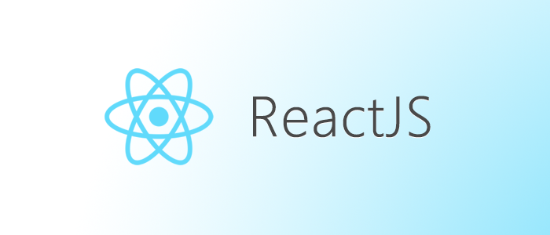

---
<h1 align="center">Series ReactJS - State Management Brainstorm</h1>

#### Made by <a href="https://www.facebook.com/anhtaidang.developer">anhtaidang</a>


---
# Table of Contents
- [Explain Virtual DOM](#-explain-virtual-dom)
- [Explain Hooks in ReactJS](#-explain-hooks-in-reactjs)
- [Explain `data-` attribute in DOM HTML](#-explain-data--attribute-in-dom-html)
- [Explain useEffect vs useLayoutEffect](#-explain-useeffect-vs-uselayouteffect)

---
## 🧠 Explain Virtual DOM.

Virtual DOM (Document Object Model)
Virtual DOM (DOM ảo) là một mô hình dữ liệu đại diện cho DOM thực.<br /> 
Virtual DOM là một biểu diễn ảo của cây DOM thực tế của trang web. Nó được sử dụng để tối ưu hóa hiệu suất và cải thiện tính năng khi làm việc với DOM thật trong ứng dụng web.

Dưới đây là cách Virtual DOM hoạt động:

**1. Tạo một biểu diễn ảo của DOM**: Khi một thay đổi xảy ra trong ứng dụng web (ví dụ: sự kiện người dùng hoặc dữ liệu thay đổi), React và các thư viện tương tự tạo ra một bản sao ảo của cây DOM hiện tại. Cây này được gọi là Virtual DOM.<br/>
**2. So sánh với DOM thật**: Virtual DOM sau đó được so sánh với DOM thật để tìm ra sự khác biệt giữa chúng. Nói cách khác, React xác định xem nội dung thực tế của trang web đã thay đổi như thế nào so với biểu diễn ảo.<br/>
**3. Tính toán các thay đổi cần thiết**: Dựa trên sự khác biệt, React tính toán các thay đổi cần thiết để đưa DOM thực tế về trạng thái mới, chứa tất cả các thay đổi từ Virtual DOM.<br/>
**4. Áp dụng thay đổi vào DOM thật**: Cuối cùng, React áp dụng các thay đổi đã tính toán vào DOM thật, cập nhật giao diện người dùng theo cách hiệu quả nhất.<br/>

Lợi ích của Virtual DOM bao gồm:

- **Tối ưu hóa hiệu suất**: Virtual DOM giúp giảm thiểu số lượng thao tác trực tiếp trên DOM thật, giúp cải thiện hiệu suất của ứng dụng web.
- **Tự động xác định thay đổi**: Virtual DOM tự động xác định các phần của trang cần được cập nhật, giúp tránh việc cập nhật toàn bộ trang.
- **Giảm khả năng xảy ra lỗi**: Bằng cách sử dụng Virtual DOM, bạn có thể tránh được nhiều lỗi phổ biến liên quan đến việc thao tác trực tiếp trên DOM.

[[↑] Back to top](#table-of-contents)

## 🧠 Explain Hooks in ReactJS
Hooks là một tính năng được giới thiệu từ phiên bản React 16.8 và giúp chúng ta sử dụng các tính năng của React như state và lifecycle trong các thành phần hàm (function components).
Dưới đây là một số hook quan trọng và phổ biến trong React:

- `useState`: Cho phép bạn quản lý state trong một thành phần hàm. Bằng cách sử dụng useState, bạn có thể tạo và cập nhật biến trạng thái trong một thành phần.
- `useEffect`: Cho phép bạn thực hiện các side effect (như gọi API, thay đổi DOM, đăng ký sự kiện) sau khi thành phần đã được render. useEffect giúp bạn quản lý các hoạt động không đồng bộ.
- `useContext`: Cho phép bạn truy cập các giá trị được chia sẻ global thông qua Context API của React. Điều này giúp bạn truyền dữ liệu giữa các thành phần con mà không cần sử dụng props.
- `useRef`: Được sử dụng để tạo một tham chiếu đến một phần tử DOM hoặc một giá trị không thay đổi theo thời gian. Thường được sử dụng trong việc thao tác với DOM trực tiếp.
- `useReducer`: Cho phép bạn quản lý state bằng cách sử dụng một hàm reducer, giúp bạn xử lý các trạng thái phức tạp hơn.
- `useCallback` và `useMemo`: Được sử dụng để tối ưu hóa hiệu suất bằng cách tránh việc tính toán lại giá trị hoặc render lại thành phần không cần thiết.
- `useLayoutEffect`: Tương tự như `useEffect`, nhưng chạy đồng bộ và được sử dụng khi cần truy cập layout của DOM trước khi giao diện được cập nhật.
- `useEffectCleanup`: Được sử dụng để dọn dẹp các side effect khi thành phần bị unmount hoặc khi dependency thay đổi.

Hooks giúp viết mã React trở nên ngắn gọn, dễ đọc, và dễ bảo trì hơn. Chúng giúp bạn tái sử dụng logic, tránh việc sử dụng class components (nếu bạn muốn), và giúp tối ưu hóa hiệu suất của ứng dụng React.

[[↑] Back to top](#table-of-contents)

## 🧠 Explain `data-` attribute in DOM HTML
Thuộc tính data trong HTML là một thuộc tính cho phép bạn lưu trữ thêm thông tin hoặc dữ liệu trong DOM.
Các thuộc tính data có thể được sử dụng bằng cách sử dụng tiền tố "data-" theo sau là tên tùy chỉnh.

Dưới đây là một ví dụ về cách sử dụng thuộc tính data:
```html
<!DOCTYPE html>
<html>
<head>
    <title>Thuộc tính data trong HTML</title>
</head>
<body>
    <div id="myElement" data-user-id="123" data-username="john_doe" data-email="john@example.com"></div>
</body>
</html>
```

Trong ví dụ này, chúng ta có một phần tử <div> với ba thuộc tính `data-` khác nhau: `data-user-id`, `data-username`, và `data-email`. Các thuộc tính này lưu trữ thông tin về người dùng liên quan đến phần tử này.

Để truy cập dữ liệu trong các thuộc tính `data` này bằng JavaScript, bạn có thể sử dụng thuộc tính `dataset` của phần tử. Ví dụ:
```javascript
const myElement = document.getElementById("myElement");

const userId = myElement.dataset.userId;
const username = myElement.dataset.username;
const email = myElement.dataset.email;

console.log(userId); // "123"
console.log(username); // "john_doe"
console.log(email); // "john@example.com"
```

[[↑] Back to top](#table-of-contents)

## 🧠 Explain useEffect vs useLayoutEffect
- Trước khi giải thích về `useEffect` và `useLayoutEffect`, hãy hiểu rõ rằng cả hai đều là hooks trong React.<br/>
- Hooks là một tính năng được giới thiệu từ phiên bản React 16.8 và giúp chúng ta sử dụng các tính năng của React như state và lifecycle trong các thành phần hàm (function components).

`useEffect` và `useLayoutEffect` đều được sử dụng để thực hiện các side effect trong React. Side effect là những hành động không thuộc phạm vi của việc render giao diện người dùng, chẳng hạn như gọi API, làm thay đổi DOM, đăng ký sự kiện, v.v.

Tuy nhiên, có một sự khác biệt quan trọng giữa hai hook này liên quan đến thời điểm thực hiện side effect.

>1.`useEffect` chạy bất đồng bộ và sau khi màn hình UI được cập nhật:<br/>
>- Bạn gây ra một render nào đó ( ví dụ như thay đổi state, re-render từ component cha )
>- Render component
>- Màn hình UI được cập nhật
>- useEffect chạy

>2.`useLayoutEffect` chạy đồng bộ sau khi render nhưng trước khi màn hình UI được cập nhật:<br/>
> `useLayoutEffect` sẽ được chạy đồng bộ ngay lập tức sau khi React đã thực hiện tất cả các DOM mutations.<br/> 
> Điều này có thể hữu ích nếu bạn muốn đo lường các DOM (Như việc bạn muốn lấy vị trí cuộn, vị trí của các phần tử) và sau đó tạo DOM mutations hoặc trigger hiển thị một cách đồng bộ bằng cách cập nhật trạng thái.<br/>
>- Bạn gây ra một render nào đó ( ví dụ như thay đổi state, re-render từ component cha )
>- Render component
>- useLayoutEffect chạy, và React sẽ đợi đến khi nó chạy hoàn thành
>- Màn hình UI được cập nhật

**Tóm tắt lại**

- `useLayoutEffect`: Chỉ sử dụng trong các trường hợp bạn cần thay đổi DOM hoặc thực hiện các phép tính đo lường, các trường hợp xảy ra lỗi từ useEffect. Hãy nghĩ đến useLayoutEffect như một giải pháp.
- `useEffect`: Nếu bạn không cần tương tác với DOM trong hầu hết trường hợp nên sử dụng useEffect.

[[↑] Back to top](#table-of-contents)